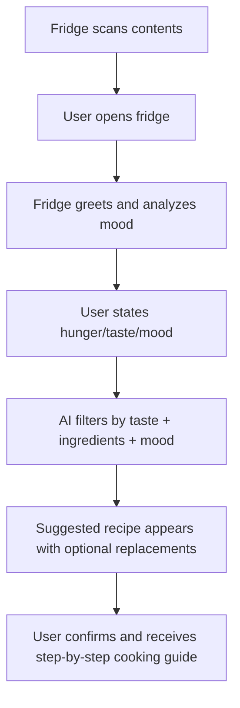

# 🧊 Smart Emotion-Responsive AI Refrigerator Assistant (SERAFINA)  
> Conversational AI + Fridge Scanner + Recipe Generator

---


## 💡 Concept Overview  
SERAFINA is a next-generation smart refrigerator system that goes beyond food storage. Equipped with **AI vision**, **emotion-aware dialogue**, and **personalized culinary intelligence**, it can scan your fridge, understand your mood and taste preferences, and suggest recipes based on available ingredients. Whether you're craving comfort food, something healthy, or just want to “use what’s left,” SERAFINA helps you make informed, enjoyable choices — all by talking with your fridge.

---

## 🍳 Example Scenario  
👩‍🍳 *User stands in front of the fridge looking tired.*  
🧊 SERAFINA: "Rough day? I noticed your mood is a bit low — how about a warm tomato basil soup using the cherry tomatoes and herbs you’ve got left?"  
👩‍💻 User: "Sounds good… but no time."  
🧊 SERAFINA: "I’ll keep it under 20 minutes. Want the recipe now or later?"

---

## 🧬 Core Features

| Feature | Description |
|--------|-------------|
| 📸 **Ingredient Recognition** | Internal camera scans and identifies all food items using computer vision. |
| 🧠 **Emotion-Aware Conversation** | Uses facial cues and voice tone to detect mood and adjust food recommendations accordingly. |
| 🍽️ **Taste & Mood-Driven Recipe Suggestion** | Combines food inventory, user preferences, and emotional state to suggest recipes. |
| 🧾 **Interactive Recipe Display** | Step-by-step cooking instructions shown on fridge screen, phone, or synced smart display. |
| 🛍️ **Expiration + Shopping Suggestions** | Warns about near-expired items and can create a shopping list if needed. |


---

## 🛠️ Technologies Used

- 🧠 **NLP Dialogue Engine** – For natural communication (e.g., ChatGPT or Dialogflow-based).
- 🤖 **Facial Emotion Recognition (FER)** – Detects joy, stress, fatigue to tailor tone and food type.
- 🧊 **Internal Fridge Vision System** – OpenCV + YOLOv8 model to scan and classify visible food.
- 🧾 **Dynamic Recipe Generation AI** – Matches available ingredients to online recipe database or in-house generator.
- 🗂️ **Preference Learning Module** – Tracks likes/dislikes and cooking history to improve suggestions.

---

## 🎯 Personalized Culinary Flow



---

## 🤖 Example Dialogue Flow

**Fridge**: “Hi Alex! You still have tofu, spinach, and eggs.  
Feeling something savory today?”

**User**: “Yeah, something salty but not heavy.”

**Fridge**: “Got it! How about a spinach tofu stir-fry? Takes 15 mins. Want to see the recipe?”

---


## 📦 Suggested Folder Structure

```
/SERAFINA-AI-Fridge/
├── vision_model/
│   ├── item_detector.onnx
│   └── expiration_predictor.py
├── emotion_module/
│   ├── facial_mood_reader.py
│   └── voice_tone_classifier.py
├── dialogue_engine/
│   ├── fridge_conversation.py
│   └── preference_tracker.json
├── recipe_generator/
│   ├── ingredient_matcher.py
│   └── instruction_formatter.py
├── assets/
│   ├── ui_mockup_1.png
│   ├── dialogue_flowchart.png
│   └── recipe_display_example.png
└── README.md
```

---

## 🔐 Ethical Considerations

- ❌ No data leaves the home unless cloud sync is opted-in.  
- 👤 Local-only face/emotion data (not stored long-term).  
- 🧠 AI transparency: explain why a recipe is chosen.  
- 🔄 User override: user can disable mood detection at any time.

---

## 📘 Future Ideas

- 📱 Mobile companion app for remote recipe planning.  
- 🍽️ Integration with smart stoves for auto-temperature sync.  
- 🧪 Nutrient-tracking & mood logging over time.  
- 🌎 Global recipe discovery by region or dietary type.

---

> 🔬 Inspired by affective computing, IoT kitchen tech, and intuitive culinary UX design.  
> 🍽️ Because your fridge shouldn't just be cold — it should be smart.
